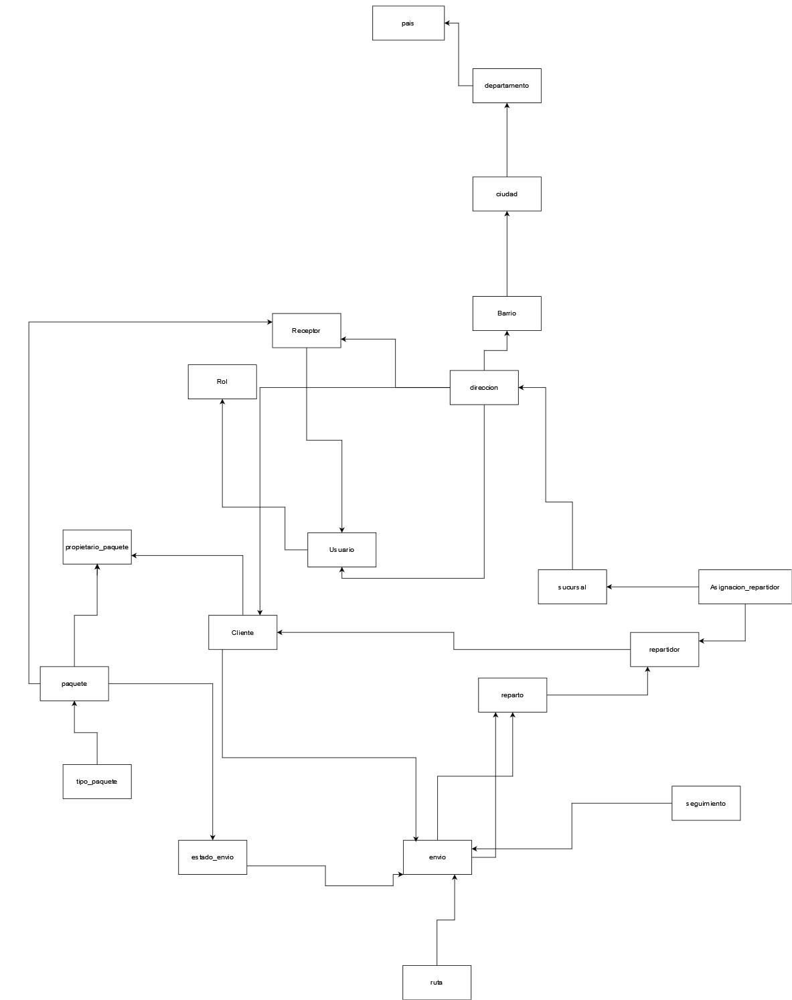
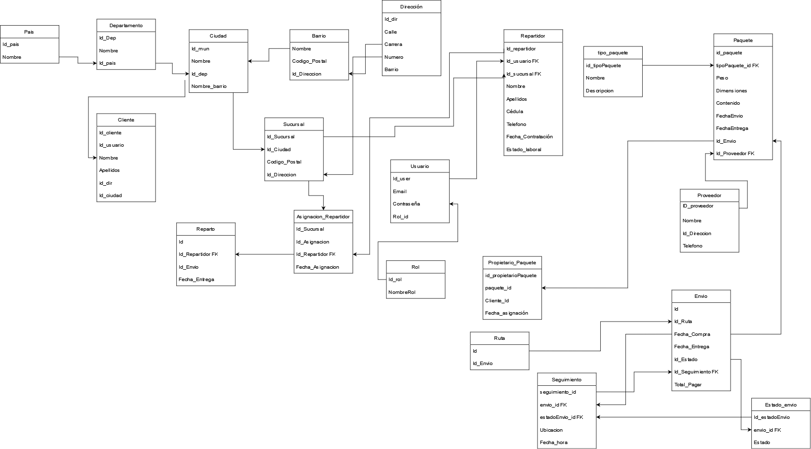
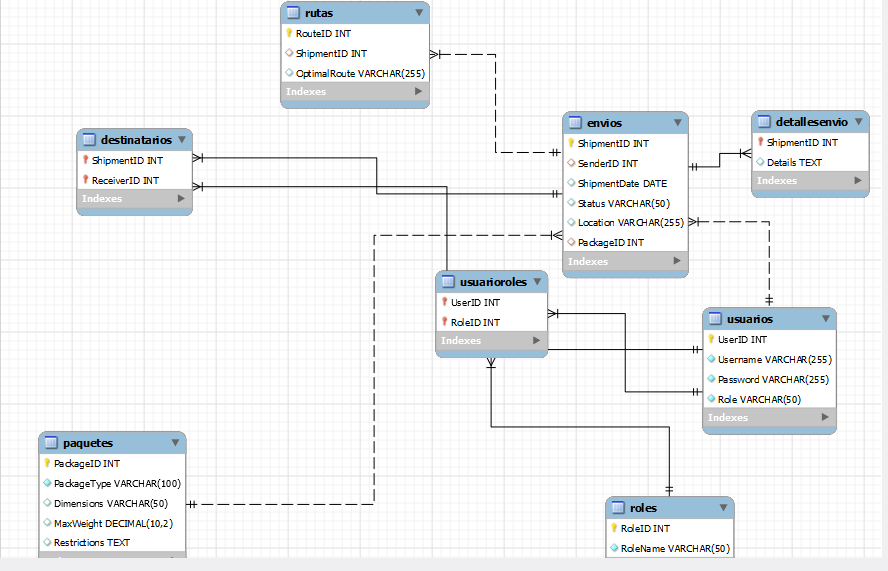
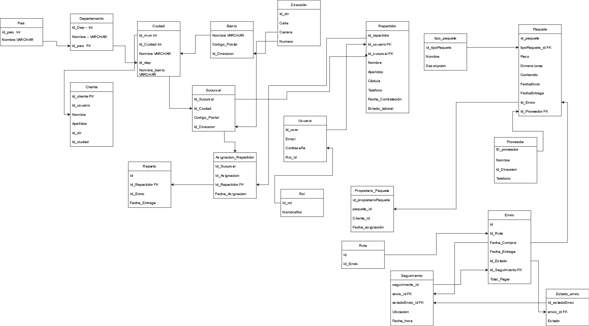

## Prueba Técnica

-

## BASES DE DATOS

En Coordinadora, reconocemos la importancia de la habilidad para resolver desafíos en el éxito de
nuestro equipo. Para evaluar tus aptitudes en la resolución de problemas, hemos diseñado esta
prueba de admisión. Es esencial que comprendas y sigas estrictamente las siguientes reglas para
llevar a cabo esta prueba de manera adecuada:

Una plataforma de gestión de envíos de
nuestra empresa Coordinadora, que permita a los usuarios registrar, rastrear y administrar
envíos de paquetes a nivel nacional e internacional. El sistema debe ser capaz de gestionar
múltiples tipos de paquetes, procesar información de seguimiento en tiempo real, asignar
rutas óptimas para el reparto y proporcionar a los usuarios información detallada y
actualizada sobre el estado y la ubicación de sus envíos. Asimismo, se requiere integrar
características de seguridad y autenticación sólidas para garantizar la protección de los
datos sensibles de los usuarios y la confidencialidad de la información de los envíos. El
Backend deberá ser altamente escalable y adaptable para acomodar el crecimiento futuro
y las necesidades cambiantes del negocio, además de ofrecer interfaces de programación de
aplicaciones (API) bien documentadas para facilitar la integración con otros sistemas y
servicios externos.

#### Requerimientos Funcionales:

- [ ] Elabore el Diagrama lógico, físico y Diagrama Relacional.
- [ ] Normalice la base de datos hasta la 4FN.

## Diagrama Lógico

## Diagrama Físico

## Diagrama Racional
sin Normalizar

Normalizada
